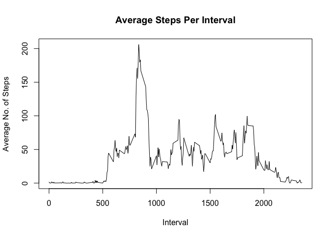

# Reproducible Research: Peer Assessment 1


## Loading and preprocessing the data


```r
## Loading libraries as needed
if(!is.element('dplyr', installed.packages()[,1]))
{install.packages('dplyr')
}else {print("dplyr library already installed")}
```

```
## [1] "dplyr library already installed"
```

```r
if(!is.element('lattice', installed.packages()[,1]))
{install.packages('lattice')
}else {print("lattice library already installed")}
```

```
## [1] "lattice library already installed"
```

```r
library(dplyr)
```

```
## 
## Attaching package: 'dplyr'
```

```
## The following objects are masked from 'package:stats':
## 
##     filter, lag
```

```
## The following objects are masked from 'package:base':
## 
##     intersect, setdiff, setequal, union
```

```r
library(lattice)
```
## Reading in data, removing missing values, analyzing the remaining data


```r
## Assumes data is extracted (if it was zipped) and resides in current working directory
activity_data <- read.csv("activity.csv", header=TRUE)

## extract any rows not missing data (i.e., not containing NAs)
No_NA_rows <- complete.cases(activity_data)
activity_data_no_NAs <- activity_data[No_NA_rows, ]

## group data by date, then sum up number of steps for each day
total_steps_per_day <- activity_data_no_NAs %>% 
                           group_by(date) %>% 
                               summarize(total_steps = sum(steps))

## total steps per day statistics
mean_steps_per_day <- mean(total_steps_per_day$total_steps)
median_steps_per_day <- median(total_steps_per_day$total_steps)

## group data by interval
## number of steps per interval statistics
avg_steps_per_interval <- activity_data_no_NAs %>% 
                              group_by(interval) %>% 
                                  summarise(avg_steps=mean(steps))

max_steps_per_interval <- max(avg_steps_per_interval$avg_steps)

max_interval_row <- filter(avg_steps_per_interval, avg_steps == max_steps_per_interval)
max_interval <- max_interval_row$interval
```

### Total Steps Per Day

```r
## histogram - frequency with which each quantity of steps occurs
hist(total_steps_per_day$total_steps, 
        xlim=c(0, 25000), 
        breaks=21, 
        main="Total Steps Per Day", 
        xlab = "Total No. of Steps")
```

<!-- -->

#### What is mean total number of steps taken per day?

```r
mean_steps_per_day
```

```
## [1] 10766.19
```

#### What is the median total number of steps taken per day?

```r
median_steps_per_day
```

```
## [1] 10765
```

### Average Daily Activity Pattern

```r
plot(avg_steps_per_interval, 
        type="l", 
        main="Average Steps Per Interval", 
        xlab="Interval", 
        ylab="Average No. of Steps")
```

<!-- -->

#### What the maximum total number of steps in an interval?

```r
max_steps_per_interval
```

```
## [1] 206.1698
```

#### Which 5-minute interval had the maximum number of steps?

```r
max_interval
```

```
## [1] 835
```
## Imputing missing values

####I decided to calculate the average number of steps for each of the 288 intervals per day, and used these values to add the missing interval data. For example, any interval "5" was given the average number of steps taken over all "5" intervals.


```r
missing_data <- activity_data[!No_NA_rows,]
number_missing_rows <- NROW(missing_data)

## copy data frame so original is not modified
missing_data_copy <- missing_data

for (i in 0:number_missing_rows) {
        
        ## extract interval value from missing data
        intv <- missing_data[i, ]$interval
        
        ## extract average number of steps for the current interval
        num_steps <- avg_steps_per_interval[avg_steps_per_interval$interval == intv, ]$avg_steps
        
        ## replace value in missing data row with this average number of steps
        ## round the value since cannot take fractional steps
        missing_data_copy[i, ]$steps = round(num_steps)
        
}

## combine earlier data frame of complete data with data frame containing imputed data
complete_data <- rbind(activity_data_no_NAs, missing_data_copy)

## sort so data frame is in date order, and interval order for each date
sorted_complete_data <- complete_data %>% 
                            arrange(date, interval)

## group by date, then add up total steps for each day
complete_total_steps_per_day <- sorted_complete_data %>% 
                                    group_by(date) %>% 
                                        summarize(total_steps = sum(steps))

## statistics
mean_total_steps_complete <- mean(complete_total_steps_per_day$total_steps)
median_total_steps_complete <- median(complete_total_steps_per_day$total_steps)
```

#### Number of rows missing values in the original data set

```r
number_missing_rows
```

```
## [1] 2304
```

### Total number of steps per day including imputed data

```r
hist(complete_total_steps_per_day$total_steps, 
     xlim=c(0, 25000), 
     ylim=c(0,20),
     breaks=21, 
     main="Total Steps Per Day - All Days", 
     xlab = "Total No. of Steps")
```

<!-- -->

#### Mean number of steps per day with imputed data

```r
mean_total_steps_complete
```

```
## [1] 10765.64
```
#### Median number of steps per day with imputed data

```r
median_total_steps_complete
```

```
## [1] 10762
```

##### The mean and median number of steps per day with the missing data and without is basically the same, which is to be expected, since I used average values to replace the missing data.  The slight difference is due to the fact that the substitute values were rounded before being added to the "missing data" data frame, since one cannot take fractional steps.


## Comparing weekdays with the weekend


```r
## average steps per interval for weekend days
## identify each date as a day of the week
## extract out Saturday and Sunday rows
## group by intervals and sum up steps per each interval
## add column identifying each resulting row as a "weekend" day
avg_steps_interval_weekend <- sorted_complete_data %>% 
                                  mutate(day_of_week = weekdays(as.Date(date))) %>% 
                                      filter(day_of_week == "Saturday" | day_of_week == "Sunday") %>% 
                                          group_by(interval) %>% 
                                              summarize(avg_steps = mean(steps)) %>% 
                                                  mutate(category = as.factor("weekend"))

## average steps per interval for weekday days
## identify each date as a day of the week
## extract out rows that are not Saturdays and Sundays
## group by intervals and sum up steps per each interval
## add column identifying each resulting row as a "weekday" day
avg_steps_interval_weekday <- sorted_complete_data %>% 
                                  mutate(day_of_week = weekdays(as.Date(date))) %>% 
                                      filter(day_of_week != "Saturday" & day_of_week != "Sunday") %>% 
                                          group_by(interval) %>% 
                                              summarize(avg_steps = mean(steps)) %>% 
                                                  mutate(category = as.factor("weekday"))

## statistics
mean_weekday <-mean(avg_steps_interval_weekday$avg_steps)
mean_weekend <-mean(avg_steps_interval_weekend$avg_steps)

## combine weekend and weekday data frames
all_days_avg_steps_interval <- rbind(avg_steps_interval_weekend, avg_steps_interval_weekday)
```


### Are there differences in activity patterns between weekdays and weekends?

##### The individual had taken, on average, more steps per interval on the weekend than during the week.


#### Mean number of steps per interval during the week

```r
mean_weekday
```

```
## [1] 35.60864
```
#### Mean number of steps per interval on the weekend

```r
mean_weekend
```

```
## [1] 42.36458
```


```r
xyplot(avg_steps ~ interval | category, 
    data = all_days_avg_steps_interval, 
    type="l", 
    layout=c(1,2), 
    xlab = "Interval", 
    ylab = "Average No. of Steps")
```

<!-- -->
